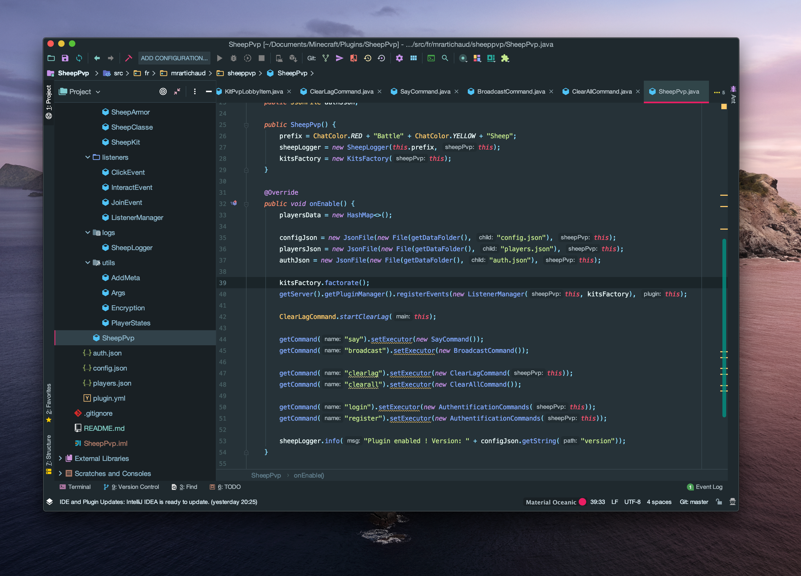

<h1 align="center"><b>BattleSheep</b></h1>

> The official plugin of BattleSheep


This plugin is the core of BattleSheep server. <br>
Ce plugin est le coeur du serveur BattleSheep.

It makes the tab, the scoreboard, the kits working. Everything you see is made by this plugin.<br>
Ce plugin réalise le tab, le scoreboard, les kits. Tout ce que vous pouvez voir à l'écran est réalisé par ce plugin.



## Installation

```sh
git clone https://github.com/NoobiCodi/SheepPVP.git
```

## Development setup

Work with IntellijIDEA.

## Release History

* 2.0.0
    * NEW VERSION
    * start again but better
* 1.2.0
    * Added [VodkaChat](https://www.spigotmc.org/resources/vodkachat.74175/)
    * removed some issues
* 1.1.0
    * Added bunch of features (Tabs, scoreboard)
* 1.0.0
    * Started

## Contributing

1. Fork it
2. Create your feature branch (`git checkout -b feature/fooBar`)
3. Commit your changes (`git commit -am 'Add some fooBar'`)
4. Push to the branch (`git push origin feature/fooBar`)
5. Create a new Pull Request